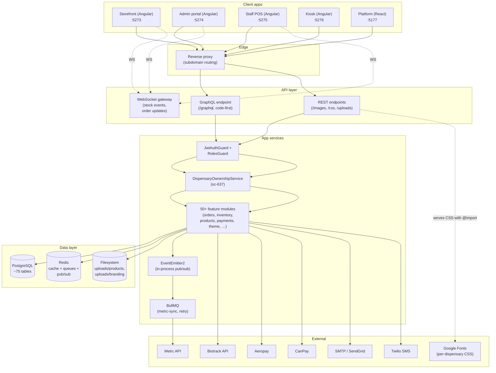

# CannaSaaS — Architecture Document

_Last reviewed: 2026-06-15. Source of truth is the codebase; when this document and the code disagree, the code wins._

> **Update log**
>
> - **2026-06-15 (yet more later)** — PR #140 closes row 3. The camelCase column rename had actually shipped before this review (migrations `1778191000000` + `1778191100000`); the original §7 #4 note was stale. Adds a `db-naming-convention.e2e-spec.ts` regression guard.
> - **2026-06-15 (even more later)** — PR #139 closes row 13. `theme-page.ts` split into 3 child standalone components (dispensary picker, font picker, branding upload). Parent file: 766 → 630 lines.
> - **2026-06-15 (even later)** — PR #138 closes row 10. `ThemeService.setDispensaryCss` is now in `@cannasaas/ui-ng`; admin / staff / kiosk each provide a thin `AppThemeService` wired via `provideAppInitializer`. The sc-637 epic (per-dispensary theming across all 4 frontends) is functionally complete.
> - **2026-06-15 (later)** — Warnings batch PR #137 closes tech-debt rows 5, 6, 7, 8, 12, 14. Full Jest suite now 418/418 green (the 5 pre-existing failures we'd been carrying for weeks are gone).
> - **2026-06-15** — Refresh pass. Both 🔴 critical items closed on main via [PR #134](https://github.com/thewebsitewiz/cannasaas/pull/134). Three new findings added to §7 + all three (#3a filter/interceptor DI, #3b stale Swagger keys, #3c CORS dev defaults) fixed across follow-on PRs #135 and #136.
> - **2026-06-14** — First publication.

---

## 1. Executive Summary

### Project

**CannaSaaS** — multi-tenant SaaS platform for licensed cannabis dispensary operators in the NY / NJ / CT tri-state market. The hierarchy is `organizations → companies → dispensaries`, with RBAC and Metrc / Biotrack compliance baked into the data model.

### Purpose

Operators of one-or-many dispensaries get a single platform that covers:

- **E-commerce storefront** (per-dispensary, subdomain-resolved)
- **In-store kiosk** (self-service touch terminal)
- **Staff POS** (register sessions, fulfilment queue, timesheets)
- **Back-office admin** (products, orders, inventory, compliance, staffing, theme)
- **Super-admin platform** (cross-tenant management, billing, tax config)

### Key architectural decisions

| Decision                                                 | Rationale                                                                                                                                                       | Where it lives                                                                                                               |
| -------------------------------------------------------- | --------------------------------------------------------------------------------------------------------------------------------------------------------------- | ---------------------------------------------------------------------------------------------------------------------------- |
| **Monorepo (pnpm + Turborepo)**                          | One install, one set of tooling, one TypeScript version across all 5 frontends + API.                                                                           | `package.json`, `turbo.json`, `pnpm-workspace.yaml`                                                                          |
| **NestJS + GraphQL (code-first) for the API**            | Decorator-driven entity + resolver definitions; `autoSchemaFile` regenerates SDL on boot.                                                                       | [apps/api/src/app.module.ts:80-87](apps/api/src/app.module.ts#L80-L87)                                                       |
| **Angular 21 standalone + signals for 4 of 5 frontends** | New control flow (`@if`, `@for`), `signal()`, `inject()`, OnPush everywhere. Multi-project Angular workspace at `packages/angular/projects/`.                   | [packages/angular/projects/](packages/angular/projects/)                                                                     |
| **React + Vite for `apps/platform` only**                | Super-admin portal stayed React after the Angular migration (sc-626 era). Not slated to migrate.                                                                | [apps/platform/](apps/platform/)                                                                                             |
| **TypeORM with `SnakeNamingStrategy`**                   | Entity properties stay camelCase; DB columns are snake_case. Raw SQL must use snake_case (legacy `orders` / `payments` tables don't and are flagged tech debt). | [docs/data-dictionary.md](data-dictionary.md)                                                                                |
| **PostgreSQL + Redis**                                   | Postgres for OLTP + reporting; Redis for cache (`cs:cache:` prefix), BullMQ queues, session storage, real-time stock pub/sub.                                   | [apps/api/src/common/services/cache.service.ts:15-18](apps/api/src/common/services/cache.service.ts#L15-L18)                 |
| **Per-dispensary tenancy scoped at every query**         | Every entity table has `dispensary_id`; resolvers either inject the JWT claim or enforce ownership via `DispensaryOwnershipService` (sc-637).                   | [apps/api/src/common/services/dispensary-ownership.service.ts](apps/api/src/common/services/dispensary-ownership.service.ts) |
| **Cannabis-friendly payments only (no Stripe)**          | Stripe ToS prohibits cannabis. Backend abstraction in `apps/api/src/modules/payments/` supports Aeropay (primary) + CanPay (secondary).                         | [apps/api/src/modules/payments/](apps/api/src/modules/payments/)                                                             |
| **CSS custom properties drive theming**                  | 10 preset theme files in `packages/ui/src/themes/theme.*.css`; per-dispensary overrides served by `GET /css/dispensary/:id.css`.                                | [apps/api/src/modules/theme/theme-css.controller.ts](apps/api/src/modules/theme/theme-css.controller.ts)                     |

### Technology stack overview

```
Frontend (per app)
├── packages/angular/projects/storefront    Angular 21, Apollo, signals       :5273
├── packages/angular/projects/admin         Angular 21, Apollo, signals       :5274
├── packages/angular/projects/staff         Angular 21, Apollo, signals       :5275
├── packages/angular/projects/kiosk         Angular 21, Apollo, signals       :5276
└── apps/platform                           React + Vite (super-admin only)   :5177

Backend
└── apps/api                                NestJS, GraphQL (code-first),
                                            TypeORM, BullMQ                  :3000

Shared
├── packages/ui (workspace:*)               Design tokens, theme CSS,
│                                           Apollo GraphQL operations,
│                                           generated.ts (codegen)
├── packages/types                          Shared TS types
├── packages/stores                         Shared signal stores / utils
└── packages/ui/src/themes/theme.*.css      10 themes (apothecary, casual,
                                            citrus, dark, earthy, midnight,
                                            minimal, modern, neon, regal)

Infrastructure
├── PostgreSQL                              Multi-tenant OLTP DB
├── Redis                                   Cache + BullMQ + session +
│                                           WebSocket pub/sub
└── Docker Desktop                          Local dev: dockup / dockshutdown
```

---

## 2. System Architecture Overview

### Architectural pattern

**Monorepo + layered modular backend + 5 standalone frontends sharing one design system.** The API is one NestJS app (not microservices) composed of ~50 feature modules, each a self-contained slice (entity + service + resolver + DTOs + tests). Frontends are independent Angular projects in one workspace + one React app, all consuming the same GraphQL schema and the same `@cannasaas/ui` design tokens.

Sub-patterns in play:

- **Event-driven inside the backend** — `EventEmitter2` for cross-module signals (`order.created`, `inventory.low_stock`, `order.completed`); BullMQ for retryable async work (Metrc receipt sync).
- **CQRS-light** — write paths often pass through TypeORM repositories; read paths often go through hand-tuned raw SQL for projections.
- **Multi-tenant scoping at the resolver layer** — `@CurrentUser()` + `DispensaryOwnershipService.assertOwns(...)` is the canonical pattern (sc-637).

### High-level component diagram



### Data flow — a representative order

```mermaid
sequenceDiagram
  participant C as Customer (storefront)
  participant API as NestJS API
  participant DB as Postgres
  participant SE as StockEventEmitter
  participant WS as WS gateway
  participant N as NotificationService
  participant Q as BullMQ (metrc-sync)
  participant M as Metrc

  C->>API: createOrder(input) [GraphQL]
  API->>DB: BEGIN; SELECT … FOR UPDATE inventory
  API->>DB: INSERT orders, INSERT order_line_items
  API->>DB: UPDATE inventory … RETURNING new_available, prev_available
  API->>DB: COMMIT
  API->>SE: recordChange(reserve) per line
  SE->>WS: emit inventory.stock_changed / .low_stock
  WS-->>C: WebSocket stock:changed (storefront, public projection)
  WS-->>Staff: WebSocket inventory:alert (low_stock)
  SE->>N: @OnEvent('inventory.low_stock')
  N->>DB: SELECT dispensary admins
  N->>SMTP: send templated email (with cooldown via setNxEx)
  API->>Q: emit order.created → enqueue Metrc job
  Q->>M: POST sale receipt (retry on failure)
```

---

## 3. Project Structure

### Top-level layout

```
cannasaas/
├── apps/
│   ├── api/                          NestJS backend (the only API)
│   └── platform/                     React super-admin (only remaining React app)
├── packages/
│   ├── angular/                      Multi-project Angular workspace
│   │   ├── projects/admin/           :5274
│   │   ├── projects/staff/           :5275
│   │   ├── projects/kiosk/           :5276
│   │   ├── projects/storefront/      :5273
│   │   └── projects/ui/              Shared lib (design tokens,
│   │                                 GraphQL operations + generated.ts)
│   ├── ui/                           Theme CSS files (consumed by React apps)
│   ├── types/                        Shared TypeScript types
│   └── stores/                       Shared signal stores
├── docs/
│   ├── data-model.md                 10 domain-grouped Mermaid ER diagrams
│   ├── data-dictionary.md            1,557-line column-by-column reference
│   ├── database-schema.mmd           Pure mermaid (single comprehensive)
│   ├── mermaid.mmd                   Same content as database-schema.mmd
│   ├── theme-preview/                57 static HTML pages for theme design
│   └── architecture.md               This file
├── turbo.json                        Turborepo pipeline (build, lint, test)
├── pnpm-workspace.yaml               Workspace member list
└── CLAUDE.md                         Project rules for AI coding agents
```

### `apps/api` internal layout

```
apps/api/src/
├── main.ts                           Bootstrap (Helmet, CORS, ValidationPipe,
│                                     useStaticAssets('/uploads/'), listen :3000)
├── app.module.ts                     Root module — imports ~45 feature modules
│                                     + global guards (JwtAuthGuard, RolesGuard,
│                                     KioskAttestationGuard)
├── config/
│   ├── configuration.ts              env → typed config object
│   └── database.config.ts            TypeORM DataSource factory
├── common/
│   ├── decorators/                   @Roles, @Public, @CurrentUser, @FieldAuth
│   ├── guards/                       JwtAuthGuard, RolesGuard, RateLimitGuard
│   ├── middleware/                   TenantMiddleware, CsrfMiddleware
│   ├── filters/                      GlobalExceptionFilter
│   ├── plugins/                      Apollo depth + complexity limits
│   ├── services/                     CacheService (Redis), CircuitBreaker,
│   │                                 DispensaryOwnershipService (sc-637),
│   │                                 Sentry + Metrics + Cache modules (@Global)
│   └── database/                     SnakeNamingStrategy provider
├── modules/                          50 feature modules — see below
├── database/seeds/                   Idempotent seed scripts (run via pnpm db:seed)
└── migrations/                       22+ TypeORM migrations, timestamp-prefixed
```

### Module organization convention

Every feature module follows the same shape:

```
modules/<name>/
├── <name>.module.ts                  NestJS module declaration
├── <name>.service.ts                 Business logic + DB I/O
├── <name>.resolver.ts                GraphQL resolver (queries + mutations)
├── <name>.controller.ts              (optional) REST routes
├── entities/<name>.entity.ts         TypeORM entity + GraphQL ObjectType
├── dto/                              Input + Output types
│   ├── <name>.input.ts
│   ├── <name>.type.ts
│   └── index.ts                      Barrel re-export
└── index.ts                          (optional) module-level barrel
```

Larger modules (`orders`, `metrc`, `payments`) split the service into multiple files but keep the structure.

### Angular project shape (e.g. `admin`)

```
packages/angular/projects/admin/src/app/
├── app.ts                            Root component
├── app.config.ts                     provideRouter, provideHttpClient,
│                                     provideApollo
├── app.routes.ts                     Top-level routes + lazy children
├── core/                             Cross-cutting services (auth, http
│                                     interceptors, route guards)
├── layout/                           Shell components (AdminLayout, topbar,
│                                     sidebar, stock-alert-toast)
└── pages/                            Feature pages (lazy-loaded)
    ├── dashboard/dashboard-page.ts
    ├── products/…
    ├── orders/…
    ├── inventory/…
    └── settings/
        ├── settings-page.ts
        ├── theme/theme-page.ts       sc-637 theme designer
        ├── payments/payments-page.ts sc-637 processor config
        └── …
```

### Naming conventions

| Surface                    | Convention                        | Example                                     |
| -------------------------- | --------------------------------- | ------------------------------------------- |
| TypeScript file            | `kebab-case.ts`                   | `theme-css.controller.ts`                   |
| TypeScript class           | `PascalCase`                      | `ThemeCssService`                           |
| Angular component selector | `cs-<kebab-name>`                 | `cs-theme-page`                             |
| Component file             | `<name>-page.ts` or `<name>.ts`   | `dashboard-page.ts`                         |
| TypeORM entity property    | `camelCase`                       | `displayFont`                               |
| Postgres column            | `snake_case`                      | `display_font`                              |
| GraphQL field              | `camelCase` (auto from entity)    | `displayFont`                               |
| Test file                  | `<name>.spec.ts`                  | `theme-css.service.spec.ts`                 |
| Shortcut ticket reference  | `sc-NNN` in comments              | `// sc-637 follow-on`                       |
| Migration filename         | `<timestamp>-<PascalCaseName>.ts` | `1780200000000-AddThemeBrandingAndFonts.ts` |

---

## 4. Component Deep Dive

### 4.1 `apps/api` — NestJS Backend

#### Responsibility

Single GraphQL + REST API serving all 5 frontends. Handles auth, multi-tenant scoping, business logic, payments, compliance, real-time events, file uploads, scheduled jobs.

#### Public API surface

- **GraphQL** at `/graphql` (code-first, autoSchemaFile to `apps/api/schema.gql`). ~200+ queries / mutations.
- **REST** at:
  - `POST /images/product/:productId` — product image upload
  - `POST /images/dispensary/:dispensaryId/{logo,masthead}` — branding upload (sc-637)
  - `POST /images/avatar` — user avatar
  - `GET /css/dispensary/:id.css` — per-dispensary theme CSS (sc-637)
  - `GET /uploads/...` — static file serving for uploaded media
  - `POST /webhooks/aeropay`, `POST /webhooks/canpay` — payment processor callbacks
  - `GET /health`, `GET /metrics` — ops endpoints
- **WebSocket** via `OrderGateway` (`modules/ws/order.gateway.ts`):
  - `inventory:alert` → `staff:{dispensaryId}` room
  - `stock:changed` → `storefront:{dispensaryId}` room (public projection)
  - `order:status_changed` → `dispensary:{dispensaryId}` room

#### Key design patterns

| Pattern                               | Implementation                                                                                                                                                                                         |
| ------------------------------------- | ------------------------------------------------------------------------------------------------------------------------------------------------------------------------------------------------------ |
| **Module-per-feature**                | 50 modules under `apps/api/src/modules/`, each self-contained.                                                                                                                                         |
| **Global guards**                     | `JwtAuthGuard`, `RolesGuard`, `KioskAttestationGuard` registered via `APP_GUARD` in [app.module.ts:131-134](apps/api/src/app.module.ts#L131-L134). Opt-out per route with `@Public()`.                 |
| **Decorator-based authz**             | `@Roles('super_admin', 'org_admin', …)` + `@CurrentUser()` + `DispensaryOwnershipService.assertOwns(...)`.                                                                                             |
| **Event-driven cross-module signals** | `EventEmitter2` for in-process pub/sub. Example: `OrdersService.createOrder()` → `inventory.stock_changed` → consumed by `OrderGateway` (WS), `NotificationService` (email), and `BullMQ` Metrc retry. |
| **Circuit breaker**                   | `CircuitBreaker` wrapper in `common/services/circuit-breaker.ts` protects SMTP + Twilio (5-failure threshold, 30s reset).                                                                              |
| **Repository + raw SQL mix**          | TypeORM repos for entity-shaped writes; raw `dataSource.query(sql, params)` for joins, projections, FOR UPDATE locks.                                                                                  |

#### Dependencies (external, abridged)

`@nestjs/*`, `@nestjs/graphql + @nestjs/apollo` (code-first), `@nestjs/typeorm + typeorm`, `pg`, `ioredis`, `@nestjs/bullmq + bullmq`, `nodemailer`, `twilio` (lazy-loaded), `sharp` (lazy-loaded for image processing), `helmet`, `class-validator + class-transformer`, `passport-jwt`.

### 4.2 `packages/angular/projects/storefront` — Customer Storefront

#### Responsibility

Customer-facing per-dispensary e-commerce site. Subdomain or path resolves the dispensary; `AppThemeService` link-injects the per-tenant theme CSS at boot.

#### Key components

- `app.ts` — root with `<cs-header />`, `<router-outlet />`, `<cs-footer />`, age-gate overlay, stock-eviction toasts.
- `core/tenant/dispensary-context.service.ts` — resolves dispensary by slug.
- `core/theme/app-theme.service.ts` — calls `ThemeConfigGQL`, then `ThemeService.loadTheme(slug, '/themes')` to link-inject CSS.
- `features/products/`, `features/orders/`, `features/account/` — lazy-loaded route bundles.
- `pages/home/home-page.ts`, `pages/cart/cart-page.ts`, `pages/checkout/checkout-page.ts`.

#### Hard rules (from `packages/angular/projects/storefront/CLAUDE.md`)

- CSR only — no SSR.
- Per-dispensary theme injection allowed (in fact, required).
- All purchases require 21+ age verification (enforced via `AgeGateService` + `canMatch` guards).

### 4.3 `packages/angular/projects/admin` — Dispensary Back-Office

#### Responsibility

Per-dispensary back-office: products, orders, inventory, compliance, staffing, theme designer, payment processor config.

#### Key components

- `layout/admin-layout.ts` — sidebar shell with 18+ nav items.
- `pages/settings/theme/theme-page.ts` — full theme designer (color editor, preset gallery, font dropdowns, logo/masthead upload, site picker for org_admin) — last touched by PR #128.
- `pages/settings/payments/payments-page.ts` — Aeropay / CanPay processor toggle + Test connection.
- `pages/dashboard/` — KPI cards, live order ticker, low-stock widget (consumes `inventory:alert` WS event).

#### Hard rules (from `packages/angular/projects/admin/CLAUDE.md`)

> ⚠️ **CLAUDE.md says admin must NOT do per-tenant theme injection inside itself** — the theme designer configures the **storefront's** theme, not admin's. Sc-637 follow-up is slated to flip this rule (next PR after #128).

### 4.4 `packages/angular/projects/staff` — In-Store POS

#### Responsibility

Staff POS terminal: register sessions, new orders, order queue, fulfillment, timesheets.

#### Key components

- `layout/staff-shell.ts` — top header with register-status pill, theme toggle (modern ↔ dark), alert mute, logout.
- `pages/new-order-page.ts` — product search + cart + customer lookup, gated by an active register session.
- `pages/queue-page.ts` — orders awaiting fulfillment.
- `core/stock-alerts/stock-alerts.service.ts` — subscribes to `inventory:alert` WS broadcasts.

### 4.5 `packages/angular/projects/kiosk` — Self-Service Touch Terminal

#### Responsibility

In-store touch UI. Full-screen, no sidebar. Customer checks in, browses menu, places pickup orders.

#### Key components

- `layouts/kiosk-layout/kiosk-layout.ts` — header / footer for the in-layout routes (`/`, `/product/:id`, `/cart`, `/checkout`, `/confirm/:orderId`).
- `pages/check-in-page.ts`, `pages/setup-page.ts` — public routes outside the layout.
- `casual` theme is hard-bundled — kiosk is single-theme today.

### 4.6 `apps/platform` — Super-Admin Cross-Tenant Management

#### Responsibility

Super-admin only. View every tenant, GMV / billing rollups, edit tax rules across states, audit platform-wide activity. **Only remaining React + Vite app** post-Angular migration.

#### Key components

- `main.tsx` — `BrowserRouter` with 7 routes (`/login`, `/`, `/tenants`, `/billing`, `/tax`, `/reports`, `/activity`).
- `layouts/PlatformLayout.tsx` — sidebar wrapper for authenticated routes.
- `pages/TenantsPage.tsx`, `pages/BillingPage.tsx`, `pages/TaxConfigPage.tsx`.

### 4.7 `packages/angular/projects/ui` — Shared Angular Library

#### Responsibility

The one place every Angular project picks up GraphQL operations + design tokens + (eventually) shared primitives.

#### Public exports

- `lib/graphql/generated.ts` — codegen output (~260KB). Re-exports everything: `*GQL` Apollo classes, `*Query` / `*Mutation` types, enums.
- `lib/graphql/operations/*.graphql` — source `.graphql` files; codegen runs from these.
- `themes/theme.*.css` — the 10 preset stylesheets, also copied into `dist/ui/themes/` for runtime injection.

#### Build pipeline

`ng-packagr` builds the library to `packages/angular/dist/ui/`. Consumed via `@cannasaas/ui-ng` workspace alias (different from `@cannasaas/ui` which is the React theme package).

---

## 5. Data Architecture

### 5.1 Data models

~54 main entities + 12 FK-bearing lookup tables = **75 tables**. Full inventory in [docs/data-model.md](data-model.md) (Mermaid ER, domain-split) and [docs/data-dictionary.md](data-dictionary.md) (column-by-column).

**Domain groupings:**

1. **Tenancy backbone** — `organizations → companies → dispensaries`
2. **Users, profiles, sessions** — `users`, `customer_profiles`, `employee_profiles`, `customer_addresses`, `age_verifications`, `refresh_tokens`, `kiosk_devices`
3. **Products & catalog** — `brands`, `manufacturers`, `strain_data`, `products`, `product_variants`, `product_batches`, `product_pricing`, `lab_tests`, `lab_test_results`
4. **Inventory & stock movement** — `inventory`, `inventory_transactions`, `inventory_transfers(_items)`, `inventory_counts(_items)`, `inventory_adjustments`
5. **Orders, line items, payments** — `orders`, `order_line_items`, `payments`, `dispensary_payment_processors`, `order_tracking`
6. **Compliance** — `metrc_credentials`, `biotrack_credentials`, `metrc_sync_logs`, `metrc_manifests(_items)`, `compliance_logs`, `waste_destruction_logs`, `reconciliation_reports(_items)`, `audit_log`, `regulatory_library`
7. **Workforce** — `register_sessions`, `pos_integrations`, `pos_product_mappings`, `pos_sync_logs`, `shift_templates`, `scheduled_shifts`, `shift_swap_requests`, `time_entries`, `time_off_requests`, `driver_profiles`, `delivery_trips`, `delivery_zones`, `delivery_time_slots`, `employee_certifications`, `performance_reviews`
8. **Promotions** — `promotions`, `promotion_products`, `promotion_categories`
9. **Notifications & theme** — `notification_templates`, `notification_log`, `theme_configs`
10. **Lookups** — `lkp_product_types`, `lkp_product_categories` (self-referential), `lkp_unit_of_measure`, `lkp_packaging_types`, `lkp_extraction_methods`, `lkp_tax_categories`, `lkp_lab_test_categories`, `lkp_metrc_item_categories`, `lkp_metrc_adjustment_reasons`, `lkp_adjustment_reasons`, `lkp_positions`, `lkp_certification_types`

### 5.2 Database design

- **Postgres 15+**, single logical database (`cannasaas`), no logical sharding.
- **Tenancy enforced at the row level** — every business table has `dispensary_id`. Application code (not RLS) enforces scoping.
- **Naming**: snake_case everywhere via `SnakeNamingStrategy`. **Five legacy tables violate this convention** (`orders`, `order_line_items`, `payments`, `dispensary_payment_processors`, `promotions*` group) and use quoted camelCase — flagged in `docs/data-dictionary.md` and [PR #122](https://github.com/thewebsitewiz/cannasaas/pull/122) fixed half of these.
- **Indexes**: composite `(dispensary_id, …)` on every high-traffic table; unique partial indexes for "one active per X" (e.g. `idx_register_sessions_one_open_per_user WHERE status = 'open'`).
- **Migrations**: only TypeORM migrations, never `synchronize: true` in production. 22 migrations in `apps/api/src/migrations/`.

### 5.3 State management

#### Backend

- **Per-request state** lives in `req.user` (JWT payload), `req.tenantContext` (from `TenantMiddleware`).
- **Cross-request shared state** lives in Redis via `CacheService` ([cache.service.ts:14-21](apps/api/src/common/services/cache.service.ts#L14-L21)) with namespaces:
  - `cs:cache:` — generic application cache
  - `cs:cache:theme:{dispensaryId}` — theme config snapshot (5 min TTL)
  - `cs:cache:lowstock:{dispensaryId}:{templateCode}:{productName}` — email dedup cooldown (60 min)
  - `cs:cache:stock:{variantId}` — real-time inventory count (5 min)

#### Frontend (Angular apps)

- **Signals first** (`signal()`, `computed()`, `effect()`, `linkedSignal()`, `resource()`, `rxResource()`).
- **Services own state** — injectable singletons hold signals; components read via `inject(SomeService).foo()`.
- **Apollo cache** handles GraphQL response caching; consumed via `rxResource({ stream: ({ params }) => apolloGql.fetch(...).pipe(map(...)) })`.
- **NgRx SignalStore** allowed for complex cross-feature state with derived selectors + async lifecycle. **Not classic NgRx, not Akita.**
- **`BehaviorSubject` / `Subject` for component-readable state is forbidden** per `CLAUDE.md`.

### 5.4 Data flow / transformation patterns

- **Order placement** — see sequence diagram in §2.
- **Theme save** — `SaveThemeConfigGQL` (admin) → `ThemeResolver.saveThemeConfig` → `DispensaryOwnershipService.assertOwns` → `ThemeService.save` (TypeORM repo) → `CacheService.del('theme:{id}')`. Next read repopulates the cache; `ThemeCssService.generate` (called from `GET /css/dispensary/:id.css`) reads via `ThemeService.getByDispensaryId` → emits one CSS file with `@import` for fonts + `:root { … }` block.
- **Low-stock alert** — `OrdersService.createOrder` reserve path → `StockEventEmitterService.recordChange` → `EventEmitter2.emit('inventory.low_stock')` → consumed in parallel by `OrderGateway` (WS broadcast) and `NotificationService.onLowStock` (email fan-out with cooldown).

---

## 6. API & Integration Layer

### 6.1 GraphQL schema

- **Code-first** — `@ObjectType()` on entities, `@InputType()` on inputs, `@Query()` / `@Mutation()` on resolver methods. `autoSchemaFile: join(process.cwd(), 'schema.gql')` writes the SDL to disk on boot ([app.module.ts:80-87](apps/api/src/app.module.ts#L80-L87)).
- **Plugins applied**:
  - `depthLimitPlugin` (max query depth)
  - `complexityLimitPlugin` (cost-based limit)
- **Playground enabled** when `NODE_ENV !== 'production'`.
- **Single endpoint**: `/graphql`.
- **Subscriptions**: no — real-time uses WebSockets via `socket.io`, not GraphQL subs.

### 6.2 REST endpoints

| Path                                 | Method | Purpose                     | Auth                                                     |
| ------------------------------------ | ------ | --------------------------- | -------------------------------------------------------- |
| `/health`                            | GET    | k8s liveness                | `@Public()`                                              |
| `/status`                            | GET    | API status                  | `@Public()`                                              |
| `/metrics`                           | GET    | Prometheus scrape           | `@Public()`                                              |
| `/css/dispensary/:id.css`            | GET    | Per-dispensary theme CSS    | `@Public()`                                              |
| `/images/product/:productId`         | POST   | Product image upload (5 MB) | `@Roles('dispensary_admin', 'org_admin', 'super_admin')` |
| `/images/product/:productId`         | DELETE | Remove product image        | same                                                     |
| `/images/product/:productId/gallery` | POST   | Append gallery image        | same                                                     |
| `/images/dispensary/:id/logo`        | POST   | Branding logo (2 MB)        | same + `DispensaryOwnershipService.assertOwns`           |
| `/images/dispensary/:id/masthead`    | POST   | Branding masthead (5 MB)    | same + `DispensaryOwnershipService.assertOwns`           |
| `/images/avatar`                     | POST   | User avatar (2 MB)          | All authenticated roles                                  |
| `/uploads/**`                        | GET    | Static file serving         | `@Public()`                                              |
| `/webhooks/aeropay`, `/canpay`       | POST   | Processor callbacks         | Signature-verified                                       |

### 6.3 Authentication & authorization

#### Authentication

- **JWT (Passport-JWT)** issued by `AuthService.login` / `AuthService.register`. Token payload shape ([jwt.strategy.ts:7-16](apps/api/src/modules/auth/strategies/jwt.strategy.ts#L7-L16)):
  ```ts
  interface JwtPayload {
    sub: string; // user id
    email: string;
    role: string;
    dispensaryId?: string;
    organizationId?: string;
    tokenId?: string; // only for kiosk-provisioned tokens (sc-192)
  }
  ```
- **Refresh tokens** stored in `refresh_tokens` table with `expires_at` + `is_revoked`.
- **Kiosk attestation** — `KioskAttestationGuard` validates per-device key rotation (sc-474).

#### Authorization

- **`@Roles(...)`** decorator + `RolesGuard` ([roles.guard.ts](apps/api/src/common/guards/roles.guard.ts)) — role membership.
- **`DispensaryOwnershipService.assertOwns(user, dispensaryId)`** — tenant ownership check used by every mutation that takes a `dispensaryId`. Rules ([dispensary-ownership.service.ts:36-83](apps/api/src/common/services/dispensary-ownership.service.ts#L36-L83)):
  - `super_admin` → any dispensary
  - `org_admin` → any dispensary whose company belongs to their organization (JOIN to `companies`)
  - `dispensary_admin` → only the dispensary in their JWT claim
- **`@Public()`** opts a route out of the global `JwtAuthGuard`.
- **`@CurrentUser()`** GraphQL param decorator ([current-user.decorator.ts](apps/api/src/common/decorators/current-user.decorator.ts)) extracts the JWT payload from `ctx.req.user`.

### 6.4 Third-party integrations

| Integration      | Module                                          | Purpose                                                                                   |
| ---------------- | ----------------------------------------------- | ----------------------------------------------------------------------------------------- |
| **Aeropay**      | `modules/payments/aeropay/`                     | Pay-by-bank ACH primary processor                                                         |
| **CanPay**       | `modules/payments/canpay/`                      | QR-code ACH secondary processor                                                           |
| **Metrc**        | `modules/metrc/`                                | State seed-to-sale compliance (NY/NJ/CT). Sale receipts + manifests. BullMQ-backed retry. |
| **Biotrack**     | `modules/biotrack/`                             | Alternate compliance system for states that use it                                        |
| **Google Fonts** | `modules/theme/fonts.ts`                        | Curated allowlist (10 display + 6 body). Theme CSS endpoint emits `@import url(...)`.     |
| **SMTP**         | `modules/notifications/notification.service.ts` | Email (defaults to SendGrid SMTP). Circuit-breaker-wrapped.                               |
| **Twilio**       | same                                            | SMS. Lazy-required so it's optional in dev.                                               |
| **Sentry**       | `common/services/sentry.module.ts`              | Error reporting                                                                           |
| **Prometheus**   | `common/services/metrics.module.ts`             | App-level metrics on `/metrics`                                                           |

### 6.5 Rate limiting & abuse protection

- **`RateLimitGuard`** ([rate-limit.guard.ts](apps/api/src/common/guards/rate-limit.guard.ts)) — per-handler `@RateLimit(n, windowSeconds)`. **Redis-backed** as of PR #134; registered as the first global `APP_GUARD` so floods drop before any JWT work. Keyed by `<ip>:<handler>` with TTL = window seconds.
- **Helmet** applied in [main.ts:98-106](apps/api/src/main.ts#L98-L106). In prod the full CSP is on; in dev the CSP + cross-origin-embedder are disabled so Swagger / GraphQL Playground / hot-reload work.
- **CSRF middleware** ([csrf.middleware.ts](apps/api/src/common/middleware/csrf.middleware.ts)) for cookie-bearing endpoints.
- **Body-size limits** — webhooks get 5 MB, everything else 1 MB ([main.ts:111-113](apps/api/src/main.ts#L111-L113)).

### 6.6 Versioning

- **URI versioning** via `app.enableVersioning({ type: VersioningType.URI, defaultVersion: '1' })` ([main.ts:147](apps/api/src/main.ts#L147)). All routes live under `/v1/...` (e.g. `/v1/auth/login`, `/v1/webhooks/aeropay`).
- **GraphQL is unversioned** — schema evolution is managed by additive changes + `@deprecated` directives.

### 6.7 Bootstrap pre-flight

- [main.ts:26-62](apps/api/src/main.ts#L26-L62) — `preflightDeps()` TCP-probes Redis (and Postgres, if `DATABASE_URL` is set) before NestFactory wires anything. Saves operators from a wall of TypeORM/BullMQ retry stack traces when Docker isn't running. Logs one line and `process.exit(1)`. Nice quality-of-life touch.

---

## 7. Code Review

### 7.1 Strengths (codebase-wide)

- **Consistent module shape** — every feature module follows the same `entity / service / resolver / dto/` layout. Onboarding cost is low; "where does X live" answers itself.
- **TypeScript strict everywhere** — `apps/api/tsconfig.json` extends a strict root config; no `any`, no `// @ts-ignore` outside narrow lint-disabled blocks (image controller / sharp shim only).
- **Per-PR test discipline** — every recent feature PR (#117, #120, #124, #128) ships with TC-_ Jest specs and a TEST-PLAN.md update. The "automate TC-_ on ship" loop is observable in commit history.
- **Event-driven decoupling** — `OrdersService.createOrder` doesn't know that `NotificationService` listens for low-stock alerts. New consumers can subscribe to `inventory.low_stock` / `order.completed` without touching the publishers.
- **Code-first GraphQL** — schema is regenerated from entity decorators, so schema drift between code and SDL is impossible at build time.
- **Documentation is exceptional** — `data-model.md`, `data-dictionary.md`, `mermaid.mmd`, `theme-preview/` are all recently shipped and current as of June 2026. `CLAUDE.md` files at the project root and per-app give explicit rules for both human + AI agents.
- **Signals-first frontend** — no `BehaviorSubject` proliferation; signal-based reactivity is uniform across the 4 Angular apps.

### 7.2 Issues found

#### 🔴 Critical — both fixed in [PR #134](https://github.com/thewebsitewiz/cannasaas/pull/134)

**1. ✅ `RateLimitGuard` was in-memory AND was never globally registered.**

- ~~File: `apps/api/src/common/guards/rate-limit.guard.ts:19-22`~~
- Original implementation used `new Map<string, …>()` per process — each API replica had its own bucket, every redeploy reset the buckets. AND it was never wired as `APP_GUARD`, so `@RateLimit(5, 300)` decorators in `auth.controller.ts` had **zero enforcement**.
- **Fix shipped**: rewrote to `await this.cache.checkRateLimit(...)` (Redis `INCR` + `EXPIRE`); registered as the FIRST `APP_GUARD` so floods drop before any JWT work. 6 new Jest specs cover the contract.

**2. ✅ `TenantMiddleware` trusted client-supplied headers; turned out to be entirely dead code.**

- ~~File: `apps/api/src/common/middleware/tenant.middleware.ts`~~
- Original read `x-organization-id` / `x-dispensary-id` from the request and stuffed them into `req.tenantContext` with no auth check. **Nothing in production code read `req.tenantContext`** — the middleware was purely enforcing that clients send the headers.
- **Fix shipped**: deleted the file + the `.forRoutes('*')` wiring. Tenant context is the JWT payload (`req.user.organizationId`, `req.user.dispensaryId`); ownership checks go through `DispensaryOwnershipService`. Integration tests that still set the headers are now harmless noise.

#### 🟡 Warning

**3a. ✅ `useGlobalFilters(new GlobalExceptionFilter())` and `useGlobalInterceptors(new LoggingInterceptor())` bypassed DI.**

- ~~File: `apps/api/src/main.ts:145-146`~~
- Original: instantiating with bare `new` meant the `@Optional() @Inject(SentryService)` / `@Inject(MetricsService)` constructor params always resolved to `undefined`. Sentry never received GraphQL errors; Prometheus metrics never incremented. Observability was silently disabled.
- **Fix shipped (this PR)**: registered both as `APP_FILTER` / `APP_INTERCEPTOR` providers in `AppModule` and dropped the `useGlobalFilters` / `useGlobalInterceptors` calls from `main.ts`. The optional injections now resolve correctly.

**3b. ✅ Swagger config advertised `X-Organization-Id` / `X-Dispensary-Id` as API keys.**

- ~~File: `apps/api/src/main.ts:156-164`~~
- Original: leftover from the `TenantMiddleware` deleted in PR #134. The "Authorize" panel in Swagger UI told consumers to send headers that the API no longer reads and never validated.
- **Fix shipped (this PR)**: dropped the two `.addApiKey(...)` calls. Bearer JWT is the only documented auth surface.

**3c. ✅ CORS dev defaults referenced ports that no app uses.**

- ~~File: `apps/api/src/main.ts:126-129`~~
- Original: defaults were `[5174, 5175, 5273]`. Actual Angular dev ports are **5273-5276** (storefront/admin/staff/kiosk) plus **5177** (platform). 5174 and 5175 don't match any current app per `CLAUDE.md`.
- **Fix shipped (this PR)**: aligned defaults with the real port scheme — 5177 + 5273-5276.

**3. `validateFile` cap is duplicated across `ImageService` methods.**

- File: [apps/api/src/modules/image/image.service.ts:35,143-153](apps/api/src/modules/image/image.service.ts#L143-L153) — `validateFile` checks `this.maxSize` (5 MB); `uploadBranding` re-implements the cap with kind-specific values (2 MB / 5 MB) instead of parameterizing the validator.
- **Impact**: DRY violation; adding a new file kind requires copying the inline validation block.
- **Fix**: `private validateFile(file, maxSize = this.maxSize)`; `uploadBranding` becomes `this.validateFile(file, kind === 'logo' ? 2*MB : 5*MB)`.

**4. `OrdersService` raw SQL has historically drifted from the DB schema (sc-708).**

- File: [apps/api/src/modules/orders/orders.service.ts](apps/api/src/modules/orders/orders.service.ts) — PR #122 fixed dozens of `INSERT INTO orders ("orderId", ...)` → snake_case mismatches.
- **Risk going forward**: TypeORM doesn't enforce that raw SQL matches the schema. Every raw query is a new place this can re-break.
- **Fix**: Add a Jest spec that runs each public method against a real Postgres test DB (today's `orders.service.spec.ts` mocks DataSource entirely — 3 of 5 cases were green by accident on main before PR #122).

**5. `TenantMiddleware` public-path matching is a substring `startsWith` check.**

- File: [apps/api/src/common/middleware/tenant.middleware.ts:30-32](apps/api/src/common/middleware/tenant.middleware.ts#L30-L32)
- A request to `/graphql/anything-attacker-wants` matches `/graphql` and bypasses the header check. Same for any path under `/health/...`.
- **Impact**: Low (the underlying route handlers re-check auth), but adds an unnecessary bypass surface.
- **Fix**: Use exact match or regex with `^/(graphql|health|status|metrics|changelog|docs|v1/auth)(/|$)`.

**6. `NotificationService` `findGoogleFont`-equivalent lives in TWO places.**

- Files: [apps/api/src/modules/theme/fonts.ts](apps/api/src/modules/theme/fonts.ts) (server allowlist) and [packages/angular/projects/admin/src/app/pages/settings/theme/font-catalog.ts](packages/angular/projects/admin/src/app/pages/settings/theme/font-catalog.ts) (admin dropdown).
- Comment on the admin file says "MUST stay in lockstep" but there's no automated check.
- **Fix**: Move the catalog into `packages/types/` and import from both — single source of truth.

**7. ~~`KioskDevice` entity uses camelCase property names + `@Column({ type: 'uuid' })` without explicit `name:`.~~ Resolved in PR for tech-debt #9.**

- Codified rule: every column's `databaseName` must equal `snakeCase(propertyName)` — i.e. rely on `SnakeNamingStrategy`. Explicit `@Column({ name: 'foo_bar' })` is allowed only when it agrees with the strategy output (redundant but harmless) or when allowlisted with a written reason. Guard: [apps/api/test/integration/entity-naming-convention.e2e-spec.ts](../apps/api/test/integration/entity-naming-convention.e2e-spec.ts) boots the full entity metadata graph and fails CI on any drift.
- Original survey: 47 entity files; 29 mixed explicit + implicit `name:`, 18 all-implicit, 0 all-explicit. The dominant pattern is rely-on-strategy, so codifying that direction (rather than "always explicit") avoided touching ~620 column declarations.
- Allowlist contains 4 entries for `ThemeConfig.{success,warning,error,info}` → `color_*` columns: the bare names are also the GraphQL SDL field names and renaming would break the admin theme editor's mutation contract.

#### 🔵 Suggestion

**8. `app.module.ts` imports list is unstructured (~45 imports).**

- File: [apps/api/src/app.module.ts:18-62](apps/api/src/app.module.ts#L18-L62)
- 45 feature module imports in alphabetical-ish order with no grouping. Hard to skim.
- **Suggestion**: Group by domain in comments:
  ```ts
  // Tenancy
  OrganizationsModule, CompaniesModule, DispensariesModule,
  // Catalog
  ProductsModule, BrandsModule, ManufacturersModule, ProductDataModule,
  // Orders + payments
  OrdersModule, PaymentsModule,
  // ...
  ```

**9. `theme-page.ts` is ~600 lines and combines template + class.**

- File: [packages/angular/projects/admin/src/app/pages/settings/theme/theme-page.ts](packages/angular/projects/admin/src/app/pages/settings/theme/theme-page.ts)
- The template is a multi-hundred-line inline string. Editability is OK but linting / Prettier alignment is awkward.
- **Suggestion**: Extract preset gallery, color editor, fonts/branding into child standalone components (`ThemePresetGallery`, `ThemeColorEditor`, `ThemeBrandingEditor`). Each one becomes ~80 lines and unit-testable in isolation.

**10. Magic strings for event names.**

- Files: many event consumers / publishers — `@OnEvent('inventory.low_stock')`, `eventEmitter.emit('order.created')`.
- Some are exported as constants from `apps/api/src/modules/inventory/stock-events.ts` (`STOCK_LOW_EVENT`), but other modules (`OrdersService`) inline the strings.
- **Suggestion**: Move all event names into a single `apps/api/src/common/events/event-names.ts` and import everywhere.

**11. `cors-origins.ts` has env-driven origins but no env validation.**

- File: [apps/api/src/common/cors-origins.ts](apps/api/src/common/cors-origins.ts) — warns if `CORS_ORIGINS` isn't set but doesn't fail; production deploys without the env get permissive defaults.
- **Suggestion**: In production, fail-fast on missing `CORS_ORIGINS` instead of using dev defaults.

**12. Test infra split — Angular uses Vitest, API uses Jest.**

- Two runners means two configs, two mock styles, two CI steps. Not breaking, but doubles maintenance.
- **Suggestion**: Future-state, standardize on Vitest (per Angular 21 default). Migrate API specs gradually.

### 7.3 Per-area highlights

#### `apps/api/src/modules/theme/` (sc-637 family — recent work)

- ✅ Cleanly split into `theme.service.ts` (CRUD), `theme-css.service.ts` (CSS rendering), `theme-css.controller.ts` (REST). Single responsibility per file.
- ✅ `ThemeCssService.collectFontImports` ([theme-css.service.ts:30-37](apps/api/src/modules/theme/theme-css.service.ts#L30-L37)) dedups when display + body fonts share a URL — small but thoughtful.
- 🔵 `theme-css.controller.ts` builds the ETag from `dispensaryId + updatedAt + length` — collision risk is real but vanishingly small. Could use a content hash for stricter correctness.

#### `apps/api/src/modules/inventory/`

- ✅ `StockEventEmitterService.recordChange` ([stock-event-emitter.service.ts](apps/api/src/modules/inventory/stock-event-emitter.service.ts)) is the canonical funnel; PR #120 wired the order paths through it.
- 🟡 The `inventory_transactions` INSERT references `dispensary_id` but the SELECT it reads from uses `inv.dispensary_id` (from `RETURNING *`) — works because of SnakeNamingStrategy, but worth a comment for the next maintainer.

#### `apps/api/src/modules/orders/`

- 🟡 `orders.service.ts` is 1,000+ lines; consider splitting status-transition mutations (`confirmOrder`, `startPreparing`, `markReady`) into a dedicated state-machine class.
- 🔴 The pre-existing `orders.service.spec.ts` has 3 failing tests on main (createOrder + cancelOrder) that were broken before the recent fixes. They mock `dataSource.query` while the methods use `qr.query` — the spec was never validating the right surface. **Action**: rewrite or delete those specs; they're false confidence.

#### `packages/angular/projects/admin/src/app/pages/settings/theme/theme-page.ts`

- ✅ Test coverage is excellent — 25/25 specs pass, including new TC-THEME-FONT / -BRAND / -SCOPE cases (PR #128).
- 🔵 The "Download CSS" button (`onExportCss`) builds CSS using a different token map (`CSS_VAR_MAP` in the page) than the server-side generator (`ThemeCssService.renderRoot`). Two implementations of the same export are a drift risk.

#### `packages/angular/projects/storefront/src/app/core/theme/app-theme.service.ts`

- ✅ Theme resolution is the cleanest of the 5 apps — uses `DispensaryContextService` for tenancy + `ThemeService.loadTheme` for the actual injection. Other apps will adopt this pattern in the next theme PR.
- 🔵 Falls back to `'dark'` on fetch failure — could be `'modern'` (the default everywhere else) for visual consistency.

---

## 8. Technical Debt Register

| #   | Item                                                                                                                                   | Severity | Effort | Priority | Notes                                                                                                                        |
| --- | -------------------------------------------------------------------------------------------------------------------------------------- | -------- | ------ | -------- | ---------------------------------------------------------------------------------------------------------------------------- |
| 1   | ~~In-memory rate limiter that doesn't survive restarts~~                                                                               | ✅       | —      | done     | Fixed in PR #134 — now uses `CacheService.checkRateLimit` and is registered as the first `APP_GUARD`. 6 new specs.           |
| 2   | ~~`TenantMiddleware` trusts client headers without auth check~~                                                                        | ✅       | —      | done     | Fixed in PR #134 — middleware was dead code (no consumers of `req.tenantContext`); deleted entirely.                         |
| 2a  | ~~Global filter + interceptor instantiated with bare `new` in `main.ts` — DI is bypassed; Sentry + Metrics silently disabled~~         | ✅       | —      | done     | Fixed in this PR — moved to `APP_FILTER` / `APP_INTERCEPTOR` providers in `AppModule`. §7 #3a.                                |
| 2b  | ~~Swagger advertises `X-Organization-Id` / `X-Dispensary-Id` API keys that no longer do anything~~                                     | ✅       | —      | done     | Fixed in this PR. §7 #3b.                                                                                                    |
| 2c  | ~~CORS dev defaults reference ports 5174/5175 that no app uses~~                                                                       | ✅       | —      | done     | Fixed in this PR — defaults now 5177 + 5273-5276. §7 #3c.                                                                    |
| 3   | ~~Camel-case legacy columns in `orders`/`order_line_items`/`payments`/`promotions`/`dispensary_payment_processors`~~                   | ✅       | —      | done     | Already migrated by `1778191000000-RenameCamelCaseColumns` + `1778191100000-RenamePromotionsCamelCase` (both predate this review). My original §7 #4 note was stale; the actual snake_case rename had shipped. PR #140 adds a `db-naming-convention.e2e-spec.ts` regression guard that fails CI if any camelCase column ever returns on those 7 tables. |
| 4   | `orders.service.ts` is 1,000+ lines mixing tax math, stock reserve, status transitions                                                 | 🟡       | L      | P1       | Split into `OrderCreator`, `OrderStateMachine`, `OrderQueryService`.                                                         |
| 5   | ~~`orders.service.spec.ts` has 3 broken tests that were green by accident pre-PR #122~~                                                | ✅       | —      | done     | Deleted in PR #137 — they mocked the wrong DataSource surface (`mockQuery` vs `qr.query`) and `{product_id}` vs `{id}` shape. |
| 6   | ~~Font catalog duplicated server vs. admin app~~                                                                                       | ✅       | —      | done     | Moved to `@cannasaas/types` in PR #137. Both consumers now import `GOOGLE_FONT_CATALOG` from there.                            |
| 7   | ~~Public-path matching is `startsWith` (open to subpath bypass)~~                                                                      | ✅       | —      | done     | Resolved by PR #134 — `TenantMiddleware` (the only `startsWith` matcher) was deleted entirely.                                |
| 8   | ~~`validateFile` cap duplicated in `uploadBranding`~~                                                                                  | ✅       | —      | done     | Parameterized `validateFile(file, maxSize?)` in PR #137; `uploadBranding` calls through it.                                   |
| 9   | ~~Mixed snake-vs-camel column declarations in entities (inconsistent style)~~                                                          | ✅       | —      | done     | Codified rule: column `databaseName` must equal `snakeCase(propertyName)`. Runtime guard at `test/integration/entity-naming-convention.e2e-spec.ts` boots the entity metadata graph and fails CI on drift. 4 `ThemeConfig` columns allowlisted (GraphQL SDL contract). §7 #7. |
| 10  | ~~Angular admin's no-tenant-theming CLAUDE.md rule blocks rollout of sc-637 to admin/staff/kiosk~~                                     | ✅       | —      | done     | Rolled out in PR #138 — `ThemeService.setDispensaryCss` added to `@cannasaas/ui-ng`; admin/staff/kiosk each provide an `AppThemeService` wired via `provideAppInitializer`. Stale source comments updated. |
| 11  | Two test runners (Vitest in Angular, Jest in API)                                                                                      | 🔵       | XL     | P3       | Long-term standardize on Vitest.                                                                                             |
| 12  | Event-name magic strings scattered (`@OnEvent('order.completed')` etc.)                                                                | 🔵       | S      | P3       | Constants file exists at `common/events/event-names.ts` as of PR #137. OrdersService migrated; existing listeners migrate opportunistically. §7 #10. |
| 13  | ~~Inline 600-line component templates in `theme-page.ts`~~                                                                             | ✅       | —      | done     | Split in PR #139 — `ThemeDispensaryPickerComponent`, `ThemeFontPickerComponent`, `ThemeBrandingUploadComponent` extracted. Existing 25/25 specs still green; selectors descend into children transparently. |
| 14  | ~~`metrc.resolver.spec` has pre-existing DI failures (`MetrcLicenseValidatorService`)~~                                                | ✅       | —      | done     | Added the missing provider mock in PR #137. 2/2 specs green.                                                                  |
| 15  | ~~`CreateRegisterSessions` migration FK pattern (sc-709 fixed) had been silently swallowing similar FK errors in `AddForeignKeyCascades`~~ | ✅       | —      | done     | Backfilled in `1780300000000-BackfillUserCascadeFKs.ts` — idempotent DROP IF EXISTS + ADD for `fk_customer_user`, `fk_employee_user`, `fk_refresh_user`. Envs that already had the FK get the same shape; envs that lost it recover. |

**Effort scale**: XS (<1h) · S (1-4h) · M (1-2d) · L (2-5d) · XL (1-2 weeks)
**Priority**: P0 = security/correctness, do now · P1 = next sprint · P2 = backlog · P3 = nice-to-have

---

## 9. Recommendations & Roadmap

### Immediate (this week, P0)

1. ~~**Swap `RateLimitGuard` to Redis-backed**~~ — ✅ done in PR #134.
2. ~~**Lock down `TenantMiddleware`**~~ — ✅ done in PR #134 (deleted the dead middleware).
3. ~~**Wire `GlobalExceptionFilter` + `LoggingInterceptor` through DI**~~ — ✅ done in this PR. Restores Sentry capture on the GraphQL exception path and Prometheus increments on every HTTP request.
4. **File Shortcut bugs** for the broken `orders.service.spec` and `metrc.resolver.spec` failures so they're tracked instead of muscle-memory-ignored.

### Short-term (next sprint, P1)

4. **Wire per-dispensary theme delivery to admin / staff / kiosk** (sc-637 follow-on, the PR I flagged earlier). After PR #128 the admin UI is in place; the apps just need to fetch `/css/dispensary/:id.css` at boot. Lift the no-per-tenant-theming rule in admin's `CLAUDE.md` at the same time.
5. **Refactor `orders.service.ts`** into 3 focused services (creator, state machine, query). Touch one mutation at a time to keep PRs small.
6. **Backfill missing cascade FKs** noted in PR #123 — write a new migration that drops + recreates the three `AddForeignKeyCascades` constraints on existing prod DBs.
7. **Consolidate font catalog** to `packages/types`.

### Long-term (next quarter, P2-P3)

8. **Real-time inventory at scale** — Redis pub/sub already in place via `CacheService.publish`; wire `OrderGateway` to fan out across multiple API replicas instead of relying on in-process `EventEmitter2`.
9. **Postgres Row-Level Security** as belt-and-braces tenant isolation. Even with `DispensaryOwnershipService` in place, RLS would defense-in-depth a SQL-injection bug from leaking cross-tenant data.
10. **Standardize on Vitest** across api + angular. Reduces "which mock style is this file" cognitive load.
11. **Split the API into proper bounded contexts** (Orders, Catalog, Compliance, Workforce, Tenancy) — still one deployable, but cleaner module boundaries make eventual extraction feasible if any becomes scale-critical.
12. **GraphQL Federation eval** — only if/when a second product line wants to share the customer + dispensary graph without consuming the entire monolith.

---

## 10. Glossary

| Term                          | Definition                                                                                                                                                                |
| ----------------------------- | ------------------------------------------------------------------------------------------------------------------------------------------------------------------------- |
| **Tenant**                    | A dispensary. Every business row has `dispensary_id`.                                                                                                                     |
| **Organization**              | Top of the hierarchy. Owns one or more companies.                                                                                                                         |
| **Company**                   | Mid-tier between organization and dispensary. Holds licensing entities.                                                                                                   |
| **Dispensary**                | Operational unit; one storefront, one kiosk fleet, one staff POS.                                                                                                         |
| **`sc-NNN`**                  | A Shortcut story id. Used in commit messages, PR titles, and code comments to reference the originating ticket.                                                           |
| **Metrc**                     | State-mandated seed-to-sale tracking system in NY/NJ/CT. Every sale receipt and inventory transfer must reconcile.                                                        |
| **Biotrack**                  | Alternate state compliance system.                                                                                                                                        |
| **Aeropay / CanPay**          | Cannabis-friendly ACH payment processors. **Stripe is forbidden.**                                                                                                        |
| **BullMQ**                    | Redis-backed queue for retryable jobs (Metrc receipt push, email throttling).                                                                                             |
| **SnakeNamingStrategy**       | TypeORM's auto-conversion of camelCase entity properties to snake_case DB columns. Five legacy tables don't follow it — flagged in this doc.                              |
| **Theme preset**              | One of 10 named CSS files in `packages/ui/src/themes/theme.*.css` (`apothecary`, `casual`, `citrus`, `dark`, `earthy`, `midnight`, `minimal`, `modern`, `neon`, `regal`). |
| **Theme designer**            | Admin UI at `/settings/theme` that lets a dispensary admin pick a preset, override the 14 color tokens, upload logo + masthead, pick display + body fonts.                |
| **`/css/dispensary/:id.css`** | REST endpoint that returns the per-dispensary theme as a single CSS file (palette + Google Fonts `@import` + brand image URLs).                                           |
| **Walk-in customer**          | Anonymous POS purchase. Uses placeholder email `walkin-######@pos.{domain}`.                                                                                              |
| **Register session**          | A staff member's active till at a specific register; one open per (dispensary, user) at a time (partial unique index).                                                    |
| **Stock crossover**           | Transition between `in_stock` ↔ `low_stock` ↔ `out_of_stock`. Triggers the corresponding event for downstream notification.                                               |
| **CLAUDE.md**                 | Root + per-app instruction files for AI coding agents. **Hard rules**, not suggestions.                                                                                   |

---

_Maintainer note: this document is a snapshot. The codebase changes weekly; re-run the relevant sub-agents and refresh when you ship a new feature module or change the auth model._
